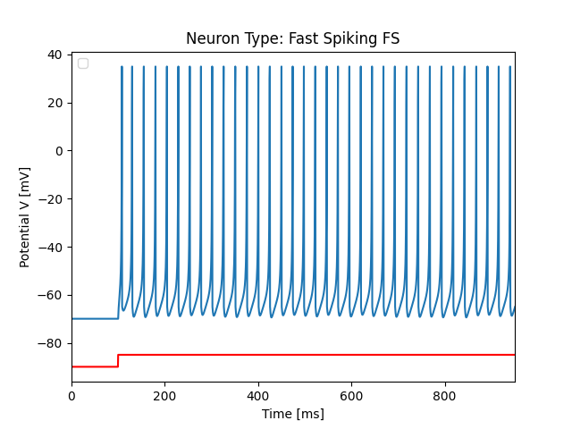

# BNN
Biological Neural Network

The Biological Neural Network presented in the paper specified at the end of this file is based on the Izhikevich Neuron Model. 

**Main Izhikevich Neuron Model Paper**
https://www.izhikevich.org/publications/spikes.pdf

In our paper there are 2 types of excitatory neurons: Regular Spiking (RS) and Chattering (CH) and 2 types of inhibitory neurons : Low Threshold Spiking (LTS) and Fast Spiking (FS). The firing patterns are given below:

 
 

The Biological Neural Network's signal is compared with an EEG signal acquired while a person was doing mathematical computations. 
For a number of 10, 100 and 1000 neurons in the network, it is shown that for 50 trials each situation, the correlation with the eeg signal increases as the number of neurons increases. 

EEG Signals used for comparison:

**The main paper is the following:**

https://iopscience.iop.org/article/10.1088/1757-899X/1254/1/012025

